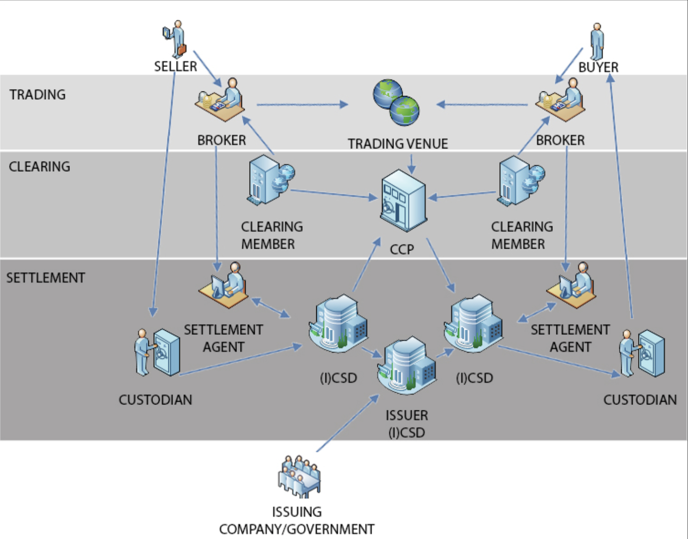

# 
 Regulation and Compliance: Libra Network as 金融基础设施

## 
 摘要

## 
 1 介绍
Libra 的使命之一是建立一套通用的、无国界的、为数十亿人服务的金融市场基础设施，创造一个更加普惠的金融体系。

金融市场基础设施是指由多个彼此独立的参与机构形成的多边系统，用于支付、证券、衍生品合约等货币和其它金融交易的清算、结算和记录。这些设施有助，是经济金融运行的的基础。现代金融市场基础设施虽然在不同国家有不同的具体组织形式，但一般包含以下五种基本职能及对应的支撑机构：

1. 支付功能：支付系统（Payment System）支付系统提供资金转账服务；
2. 存管功能：中央证券存管（Central Securities Depository ，CSD）中央证券存管提供证券集中发登记、托管、赎回等服务；
3. 清算功能：中央对手方（Central Counter Party ，CCP）中央对手方作为一种清算机制，清算机构自身介入已经达成的交易，成为卖方的买方和买方的卖方，确保已达成交易正常履约，是防范金融市场系统性风险的重要手段；
4. 结算功能：证券结算系统（Securities Settlement system，SSS）证券结算系统提供证券过户和结算服务（如典型的券款对付DvP）；
5. 报告功能：交易数据库（Trade Repository ，TR）。交易数据库是为增强市场透明性而集中收集、保存并向监管和公众披露各类交易数据的机构，是金融危机后为加强场外衍生品市场监管而新出现的FMI类型。

基于上述这些基础设施服务机构，其它金融机构，如交易场所（交易所或场外市场）、证券发行方、托管银行、买方/卖方、经纪商、清算会员、结算代理行等，面向客户展开各种金融服务。它们共同形成了一个多层级的、互相协作、互相制约的复杂网络。

另外，这些基础设施在金融监管和治理方面也扮演了关键角色。这些基础设施在金融网络中起到了核心节点的作用，它们为金融市场指定了统一的流程、规则；而且监管层通过它们监管整个金融系统。下图是美国金融监管架构图，从中可以看到基础设施在金融监管方面的重要作用。

安全、高效的金融市场基础设施对于畅通货币政策传导机制、加速社会资金流周转、优化社会资源配置、维护金融稳定并促进经济增长有重要意义。与此同时，它们也集中了风险。如果没有适当的管理，会成为流动性错配和信用风险等金融冲击的源头，也会成为传播风险的渠道。

## 
 2 金融危机的反思

2008年金融危机爆发以来，国际社会对引起危机的根源进行了深刻反思，并且诞生了两方面成果。

- 一个是2012年4月国际清算银行（BIS）发布的《金融市场基础设施原则》(PFMI)。针对金融市场基础设施的建设，PFMI分析了金融系统的主要风险(系统性风险、法律风险、流动性风险、业务风险、托管与投资风险、运营风险)，从9个方面(总体架构、信用与流动性风险管理、结算、证券存管与交易、违约管理、运营风险管理、准入机制、效率、透明度)提出了24条指导原则。PFMI从金融系统顶层设计的角度，进一步确立了全球金融市场基础设施建设标准，为世界各国开展相关工作指明了方向。

- 另一个是以比特币为代表的区块链技术。在2008年，中本聪（Satoshi Nakamoto）发表了比特币的白皮书，描述了一种不依赖于单一信用机构的记账技术。这种后来被称为区块链的新技术迅速发展，各种数字货币与公有链竞相出现，构建了一个全新的金融服务生态，引起国际社会特别是金融界的广泛关注和高度重视。原有的金融生态中，账本是由各个独立的金融机构分散管理的。在支付清结算业务过程中，多个账本彼此的通信、通过一致性协议完成交易的清结算。区块链提供了公共的账本管理平台，彼此独立的金融机构可以在同一个账本上彼此协作。这种公共账本模式为对金融系统的深远影响体现在以下几个方面：
  - 效率：跨行、跨境交易可以在公共账本上一次性完成结算，缩短了交易环节，简化了交易流程，降低了交易摩擦。
  - 风险：由于缩短了中间转账的环节，降低了对于中间人的信用风险、流动性等风险。
  - 透明度：资金流数据集中记录在一个公开、透明的账本上，提高了交易数据的完整性和可访问性。相对于监管多个分散的账本，监管一个公共账本会大幅降低监管的难度。无论是对于监管层、还是金融机构来讲，监管合规的成本也会大幅降低。
  - 自动化：利用智能合约，将金融资产映射为可编程的Token，提高资产发行、销售、流转、托管等业务的电子化、自动化
  - 标准化：众多金融机构使用同一个账本，便于统一彼此之间的通信协议、数据格式，提高金融行业规范化、标准化程度
  - 全球化：区块链建立在全球化的互联网基础上，而不是封闭的专用金融网络。各个国家和地区可以共享同一套系统，便于搭建国际化的金融系统。
  - 避免重复建设：采用国际化的公共账本，对于金融机构，可以减轻维护独立账本的负担；对于国家和地区，缓解了各自建设金融专用网络的需求。

总之，对重塑金融业未来发展，PFMI和区块链都有重大的价值。PFMI 是自顶向下、为金融系统的顶层设计提供了指导原则；区块链是自底向上、从最基础的账本管理技术入手，通过全新的技术方案重建整个金融系统。PFMI与区块链技术的出现有相同的时代背景，都是源自于次贷危机的影响，它们的目标都是要建立更加安全、高效、可靠、可信的金融系统。所以这二者虽然方法和方式不同，但是同源同宗，本质上是互补的。

## 
 3 挑战
根据PFMI的指导原则，金融基础设施应该接受中央银行、市场监管者或者其它管理部门适当、有效的管理、监管和监督。但是在实际应用过程中，区块链技术在金融监管方面还比较弱，甚至有些区块链产品的设计目标就是对抗金融监管。近年来，利用区块链技术进行洗钱等金融犯罪活动越来越多。比如根据[日本警方报告](https://www.japantimes.co.jp/news/2019/02/28/national/crime-legal/cases-money-laundering-linked-cryptocurrency-japan-tenfold-2018/#.XR2sMJP7TAK)，2018年加密货币洗钱案件增加了十倍。2017年，日本国家警察局发现了不到700起加密洗钱事件；2018年，他们发现了7,000多起同类案件。

区块链要成为金融基础设施，其中一个重要的挑战是在保留其技术优势的同时，还要满足金融监管的要求，比如说Know-Your-Customer(KYC)、Anti-Money-Laundering(AML)、Counter-Financing-of-Terrorism (CFT)等等合规要求。本质上这要求账户的真实身份信息与交易的贸易背景数据要向监管层透明，便于监控并且打击不法分子的金融犯罪行为。目前的主流区块链平台普遍无法满足合规、监管需求，具体的来讲，表现在以下几个方面：

- 用户真实身份信息的缺失
- 交易背景数据的缺失
- 交易过程中缺少合规验证环节
  
<!--
- 公开账本的隐私保护与监管透明度之间的矛盾
- 可信的预言机机制保证交易的合规性：交易背景审核
- 去中心化治理：同一账本兼容不同国家的金融监管体制

- 法律
- 概述本论文的目的和主要内容
- 隐私性：

    只有交易的参与方与金融监管方才能了解交易的相关隐私数据，其它人员无法根据公开数据推导出交易隐私信息。

-->

这个矛盾的根源在于区块链作为共享账本，满足了账本数据的公开性，无法再满足完备性。一般来讲，在金融系统中，无论是中心化账本还是去中心化账本，都无法同时满足公开性和完整性。在展开讨论之前，我们先给出完整性和公开性的定义：

- 完整性: 
  
  按照PFMI的需求：金融机构或者金融监管方需要完整的账户信息和交易信息、以及其它用于验证交易是否合规的相关信息。

- 公开性:

    一个记账节点的账户和交易数据对于其它记账节点公开透明，便于其它节点验证账本数据，并且保证账本的可信度。

对于中心化账本来讲，账本数据和交易数据是不公开的，存在信息不透明、有暗箱操作的空间，所以依赖于账本管理者的信用背书。但是由于账本数据不公开，可以保存用户和交易的隐私，有利于保存完整的交易信息，便于验证交易是否合规。

对于去中心化账本来讲，账本数据对于所有节点是公开的，其它节点可以验证所有交易数据，不需要可信的中介，依然可以保证账本数据的可信性。但是由于公开账本无法保护用户的隐私，只能将不敏感的数据上链，其它敏感数据(用户身份、交易背景)无法在链上保存。导致链上交易数据与链下背景信息的脱节，金融监管与合规非常困难。

总之，账本数据的不完整性是区块链本身固有的特征。如果将区块链应用于金融基础设施，满足 PFMI 以及各国金融法律对于监管合规相关要求，必须要创造性的解决这个难题。

## 
 4 相关工作

在PFMI指导下，各国央行与国际金融机构积极探索区块链在金融基础设施上的应用。2017年，国际清算银行（BIS）发表了一份[报告](https://www.bis.org/cpmi/publ/d157.htm)，阐述了区块链在PFMI下需要满足的需求与功能。不仅如此，在过去的几年中，多国央行组织了多项实验区块链研究项目，针对支付清结算的各个不同应用场景，评估区块链的应用前景，遗憾的是当前多个主流的区块链平台并未充分满足PFMI的要求。

- 加拿大央行 Jasper
  
    Jasper项目是Payments Canada，加拿大央行，TMX集团和埃森哲之间的合作项目，于2015年启动，旨在了解DLT如何通过开发基于区块链技术来改变加拿大的金融系统。该项目迄今已经历了三个实验阶段。Jasper项目的第一阶段使用以太坊平台构建区块链原型和概念验证系统，以调查中央银行发出的数字收据的使用，而非现金支持结算付款。第二阶段使用R3的开源分布式账本平台Corda构建了一个原型，以进一步探索：区块链如何改变中心化系统的结构和运行方式，区块链系统是否符合国际标准，以及对支付系统政策的任何潜在影响。第三阶段探讨了区块链对更广泛的加拿大金融市场基础设施的影响和潜在价值。

    - 2017年6月，加拿大央行出了一份[报告](https://www.bankofcanada.ca/wp-content/uploads/2017/05/fsr-june-2017-chapman.pdf)，对R3 CEV的Corda平台进行批评，并用金融市场基础设施原则（Principles of Financial MarketInfrastructures, PFMI）原则评估区块链系统，其中提到一个概念就是“透明度不够”（Lack of transparency）。虽然只有短短11页，且文字平淡，但内容严厉，
  
    Jasper 的研究报告指出，区块链技术的应用有助于扩展加拿大金融创新，并有可能在某一天帮助促进国内和国际金融市场一体化。但是同时指出如果要有效地将区块链纳入到金融系统，在很多方面必须符合PFMI的要求。比如说**透明度和隐私**。Jasper 发现 R3 Corda 透明度不够，即不能很快找到账户信息而需要进行搜寻。**透明度**应该是区块链的长项，来源于公共账本特征，每一个参与节点都存有同样的数据。**但Corda并没有共享账本**，每个节点可能存不同信息，加拿大央行认为这不是好的设计。

    - [2017](https://www.bankofcanada.ca/wp-content/uploads/2017/05/fsr-june-2017-chapman.pdf)
    - [2017](https://www.payments.ca/sites/default/files/29-Sep-17/jasper_report_eng.pdf)
    - [2018](https://www.payments.ca/sites/default/files/jasper_phase_iii_whitepaper_final_0.pdf)
    - [Phase II ](https://betakit.com/project-jasper-urges-private-public-sector-collaboration-to-bring-blockchain-into-financial-system/)
    - [Phase III](https://betakit.com/project-jasper-phase-iii-shows-blockchain-is-feasible-for-securities-settlements/)

- 欧洲、日本央行 Stellar

    -  2016年12月, 欧洲央行、日本央行联合发起了联合研究项目恒星(Stella), 致力于研究区块链技术对FMI的机遇与挑战。它使用 Corda，Elements 和 Hyperledger Fabric 开发了多个原型。同时用 PFMI 原则来评估这些区块链系统。此项目已经完成了3个阶段，分别研究区块链在大额支付系统、证券交易结算系统、同步跨境支付系统的前景。这份研究指出：从技术上讲，区块链有潜力改善现有金融系统，但是依然缺少成熟度，需要在法律、合规等方面进一步的评估和加强。
       
       -  [2017](https://www.ecb.europa.eu/pub/pdf/other/ecb.stella_project_report_september_2017.pdf) analysed the processing of large-value payments using DLT,
       -  [2018](https://www.ecb.europa.eu/pub/pdf/other/stella_project_report_march_2018.pdf), investigated securities delivery versus payment in a DLT environment. 
       -  [2019](https://www.ecb.europa.eu/paym/intro/publications/pdf/ecb.miptopical190604.en.pdf) The latest phase of Project Stella, “Synchronised cross-border payments,” builds on the insights gained from the previous two phases to bring our research into the broader sphere of crossborder payments.

- **总结**：
  - 这三家央行的行动表明用 PFMI 原则衡量区块链在金融系统中应用的重要性。在区块链在金融系统的应用问题上，合规性相当重要。从现有的技术成熟度来看，目前还有很多问题，离实际使用还有差距。
  - 业界普遍认为扩展性是区块链最大的问题，却不知道加拿大央行对透明度要求更高，不能快速找到账户和交易信息，系统就是能扩展也不行。在这些央行实验中遇到的问题不是化妆式(cosmetic)的问题，而是**结构性(structural)的问题**。结构性的问题不是一两天就能解决，也不是一两个月就能够解决，结构性的问题可能一两年都无法解决，而且解决方案有可能是重新做一个系统，因为原来系统结构不能匹配PFMI原则。

## 
 5 技术方案

根据“挑战”一章的结论，单纯的去中心化账本管理系统满足了账本的公开性，牺牲了完整性；反之，单纯的中心化账本管理系统满足了完整性，牺牲了公开性。从这个结论出发，去中心化账本系统必须结合中心化账本系统，其中区块链系统负责管理记账权，保证账本的可信度与透明度；中心化账本负责管理用户真实身份、交易背景数据等隐私数据，补充账本数据的完整性。这种设计路线的要点是：满足监管合规的要求的前提下，最大限度的保留区块链的技术优势。

根据这个总体设计思路，下面从组织安排、账本数据结构、合规验证协议、智能合约、准入规则等多个角度详细阐述 Libra 合规架构设计。

公链就像是一个没有任何规则的高速公路，没有限速、不分左行右行、

### 
 5.1 组织安排

在传统金融系统中，银行等金融机构接受客户的委托，以资产负债的形式管理客户的资产，同时拥有记账权、知情权和审核权。也就是说，银行不但负责代理客户处理贷记/借记事务，同时还要知晓客户的身份信息、交易背景信息，以及根据金融监管的要求审核每一笔交易的合规性。

在 Libra 生态中，金融机构依然扮演重要角色，差别在于客户的资产记录在 Libra 区块链上，记账权以去中心化的方式分配给各个验证节点，所以银行不再拥有记账权。但是银行依然拥有知情权和审核权，它负责保护客户的隐私，为 Libra 生态提供了合规服务。

从客户的角度来讲

从监管层的角度来讲

从 Libra 协会的角度来讲

- compliance service: 负责验证与保存用户身份信息，保护用户的隐私，验证交易的合规性，提供AML，CFT等服务，同时配合监管层

### 
 PII 数据模型 (参考 Civic 白皮书)

个人身份信息包含多个部分，包括但不仅限于：国家、城市、街道等地址信息，电话号码，身份证号码，护照号码，邮箱地址，生日等等。这些数据按照某种标准以层次化的格式存储。

The provability of an attestation is achieved by organizing the data into a Merkle tree, where each node representing an element of PII caintains a hash of its content and a hash of the hashes of its child nodes. This results in root hash (also known as the Merkle Root) that can be used as a fingerpint for the data being attested to. This root hash is recorded in the blockchain and signed by the Validator making the attestation as to that specific PII. Arbitrary numbers known as nounces are used to randomized hashes on structured data that have a relatively small universe of possible values to minimize the risk of any hash being reversed. If the user shell not wish to reveal all of the underlying PII that was attested to, portions of the Merkel tree can selectively be revealed, and hashes provided for any elements the User prefers not to reveal.

This structure has two advantages: 1. it enhances User control by allowing the user to selectively reveal pieces of personal information in different circumstances; 2. promotes security by using properties of blockchain to prove that the data have not been tampered with after an attestation has been made.

### 
 **账本数据的结构**

一个账户的数据可以分为三部分: 用户资产、用户身份、身份验证标识。在传统金融系统中，这三部分数据是不分离的，银行负责管理同时这三部分数据。

但是基于区块链的账户体系里，只有用户资产和身份验证标识两部分数据，描述区块链的账户体系.....，

传统中心化的账本体系的优点是便于保护用户身份信息、便于形成完整的交易数据记录，但是由于账本的管理是不公开的，提高了信用风险、运营风险、管理风险、

区块链去中心化账本体系的优点是采用公开账本，通过去中心化的方式处理交易数据，从根本上降低了账本管理的各种风险。但是由于无法验证用户的真实身份信息，交易透明度严重缺失，从技术上很难避免防止洗钱、各种金融犯罪，给监管层审查交易带来了很大的困扰。

虽然区块链上的交易具有可追溯性，但是由于身份信息的缺失，以及账户地址与身份信息之间的无关联性，

### 
 账户数据结构扩展：账户类型、验证人
- 匿名账户
- 实名账户
- 知名账户
- 系统账户

### 
 法律安排，financial compliance service 必须拥有金融牌照
- 身份信息的隐私性

### 
 智能合约 
- 添加 address.validator
- ERC20 合约扩展 
  - 数据结构
  - 转账：transfer(address to, uint256 value)
  - 添加账户: 

### 
 治理与准入
    - 资产智能合约部署
    - 系统智能合约部署
    - 知名机构的管理

### 
 合规验证流程

以支付系统为例(PFMI 附件D)，叙述合规验证流程

### 
 链上与链下数据绑定协议
    - 身份信息
    - 实名机构信息
    - 资产信息： KYA

## 
 6 总结

## 
 参考
- Libra 的使命是建立一套简单的、无国界的货币和为数十亿人服 务的金融基础设施。本白皮书概述了我们努力打造一个新的去中心化区块链、一种低波动性加密货币和一个智能合约平台的计划， 以期为负责任的金融服务创新开创新的机遇

